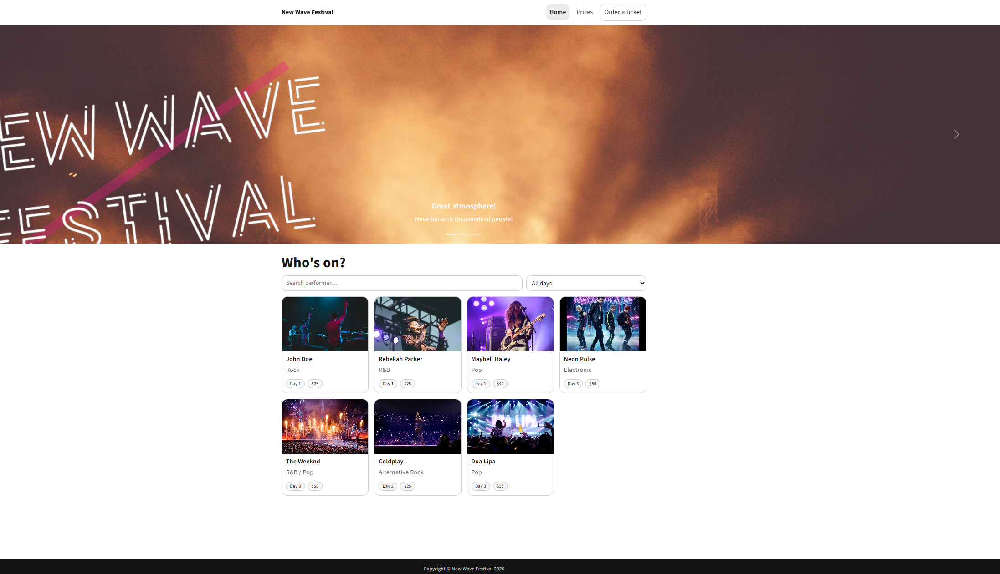
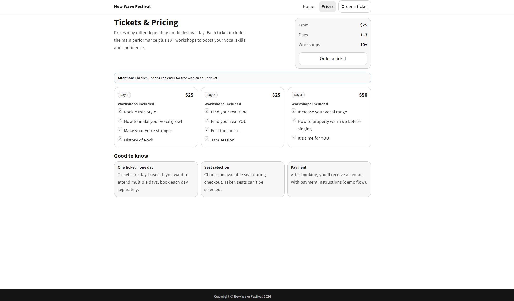
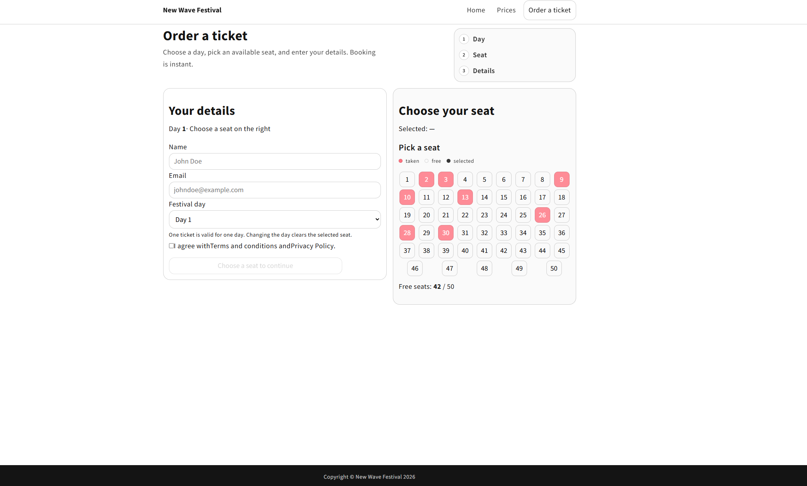

# New Wave Festival – Fullstack Event Booking App

**React · Redux · Node.js · Express · MongoDB · Socket.io**

A full-stack festival website where users can browse concerts, filter the lineup, and book seats in real time.
The project focuses on clean frontend architecture, global styling consistency, and real-time seat availability.

The application is built with **React + Redux** on the frontend and **Node.js / Express + MongoDB** on the backend.
Real-time updates are handled via **Socket.io.**

---

## Features

### Concerts & Lineup

- Browse festival lineup
- Search concerts by performer name
- Filter concerts by day
- Sort concerts (day / name / price)
- Skeleton loaders while data is loading
- Empty states when no results are found

### Ticket Booking

- Ticket order form with validation
- Seat selection per festival day
- Real-time seat availability (Socket.io)
- Disabled seats when already taken
- Visual seat legend and counter

### UI & UX

- Responsive layout (desktop & mobile)
- CSS Modules with shared design tokens
- Reusable UI components:
  - AlertBox
  - Loader
  - SkeletonGrid
  - EmptyState
- Sticky navigation
- Consistent spacing, typography, and cards
- Global layout with footer pinned to bottom

---

## Screenshots

| Home                          | Pricing                             | Book Tickets                                 |
| ----------------------------- | ----------------------------------- | -------------------------------------------- |
|  |  |  |

---

## Tech Stack

### Frontend

- React 18
- Redux + Redux Thunk
- React Router v6
- Axios
- CSS Modules (SCSS)
- Socket.io Client

### Backend

- Node.js
- Express
- MongoDB + Mongoose
- Socket.io
- dotenv
- CORS

---

## Project Structure

```bash
backend/
  controllers/
  data/
  models/
  routes/
  db.js
  package.json
  server.js

client/
  src/
    components/
      features/
      layout/
      ui/
    pages/
    redux/
    styles/
    App.jsx
    index.js
  package.json
```

## Installation

### 1. Clone repository

```bash
git clone https://github.com/kacpi95/festival-booking-app.git
cd festival-booking-app
```

### 2. Backend configuration

**Create backend/.env:**

```bash
MONGO_URL=your_mongodb_atlas_url
PORT=8000
NODE_ENV=development
```

### 3. Run backend

```bash
npm install
npm run dev
```

**Backend runs at:**

http://localhost:8000

### 4. Frontend configuration

```bash
cd client
npm install
npm start
```

**Frontend runs at:**

http://localhost:3000

---

## Real-Time Seats

- Seats are fetched from the database per selected day
- When a seat is booked, all connected clients receive updates instantly via Socket.io
- Already taken seats are disabled automatically

---

## Styling Approach

- Global design tokens (colors, spacing, radius, typography)
- Shared SCSS mixins for:
  - cards
  - inputs
  - buttons
  - grids
- CSS Modules for local scoping
- No UI frameworks for layout (custom CSS)

---

## Notes

- Development console may show Dart Sass legacy API deprecation warnings coming from CRA tooling
  (does not affect runtime or production builds).
- React Router future warnings are informational only.

## What I Learned

- Building a fullstack app with React, Express, and MongoDB
- Managing global state with Redux
- Handling real-time updates using Socket.io
- Structuring reusable UI components
- Designing and maintaining a scalable SCSS architecture
- Debugging frontend & backend integration issues
- Working with MongoDB Atlas in real projects

---

## Future Improvements

- Authentication (admin / user roles)
- Admin panel for managing concerts
- Pagination for concerts list
- Better form validation and UX feedback
- Automated tests
